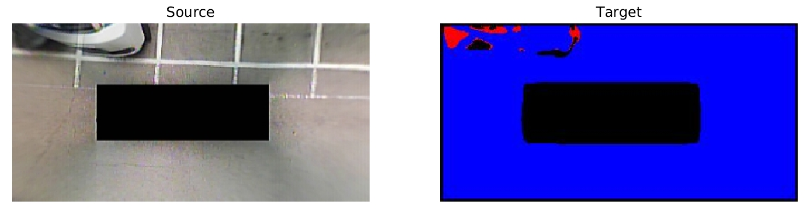
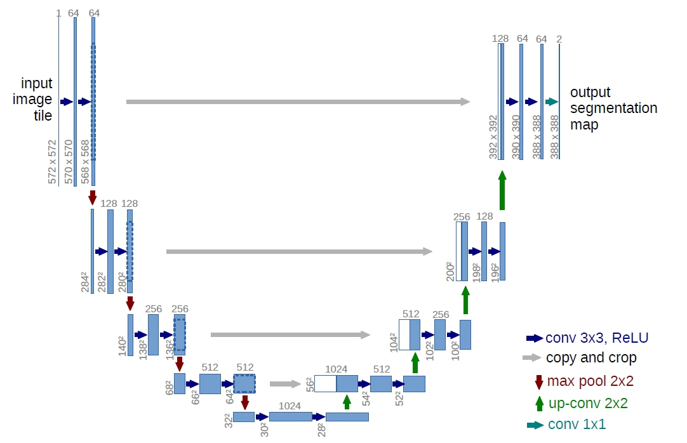

# UNet-pytorch 

[](LICENSE)

+ A PyTorch implementation of [U-Net: Convolutional Networks for Biomedical Image Segmentation](https://arxiv.org/abs/1505.04597).

### Dataset

+ Use AVM system SS(Semantic Segmentation) dataset to train, see [ChulhoonJang/avm_dataset](https://github.com/ChulhoonJang/avm_dataset).
+ Contain 4057 training images and 2706 testing images

> This dataset contains 6763 camera images at a resolution of 320 x 160 pixels. There are four categories: free space, marker, vehicle, and other objects. For each image, a corresponding ground truth image is composed of four color annotations to distinguish different classes.

### Experiment

+ I have tested this model on GeForceGTX1080Ti (1 GPU, CUDA 10.2, 11GB), trained with 50 images and run only 2 epochs with 1 batch size (Due to small gpu memory).



### Usage

```bash
# more command parameter see unet.py

# train
python3 unet.py --do_train \
                --mask_json_path 'mask.json' \
                --batch_size 128 \
                --epochs 20 \
                --save_epoch 2 \
                --do_save_summary \
                --summary_image './summary.png'
# test
python3 unet.py --do_test \
                --mask_json_path 'mask.json' \
                --test_image ./test.jpg \
                --test_save_path ./test_seg.jpg
```

### Architecture


